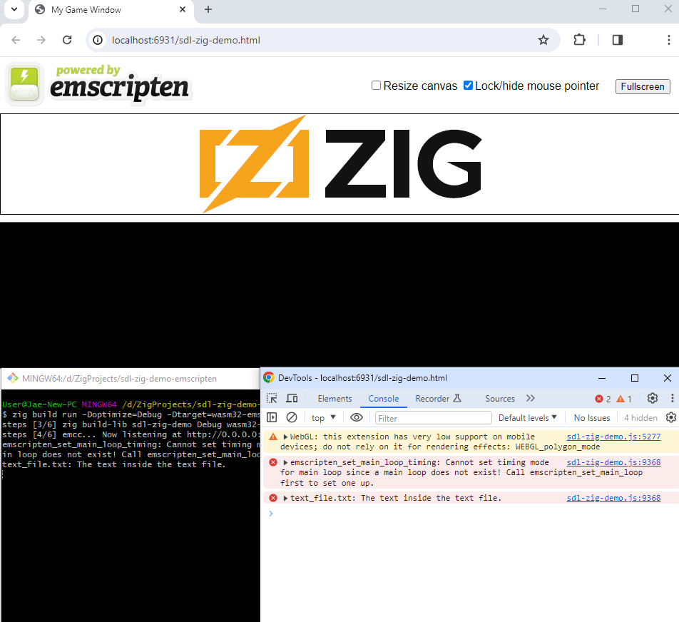

# SDL2 Zig Demo

Here's a basic window with SDL2 in Zig.



## How to build and run it for web

```
zig build run -Doptimize=Debug -Dtarget=wasm32-emscripten
```

## How to build and run it for desktop

```
zig build run
```

## Cross-Compiling

Pass a `-Dtarget` option. For example:

```
zig build -Dtarget=x86_64-windows
```

## Credits

* [Sokol Zig](https://github.com/floooh/sokol-zig) for having a nice Emscripten install / build setup that I was able to mostly copy for this project.
* [Raylib-Zig](https://github.com/Not-Nik/raylib-zig) for giving for their Emscripten setup which is how I initially got up and running.
* [Andrew Kelley](https://github.com/andrewrk/sdl-zig-demo) for Zig itself, their SDL demo code and everything!
